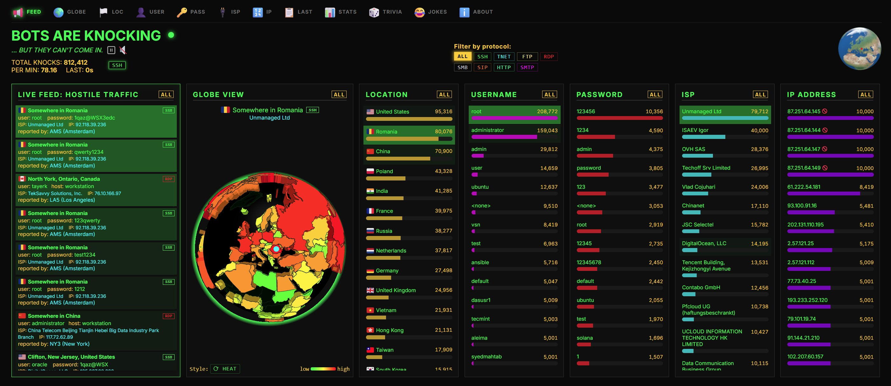
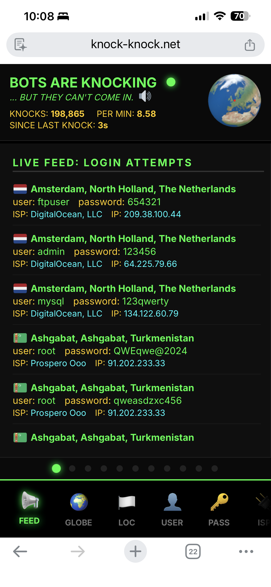
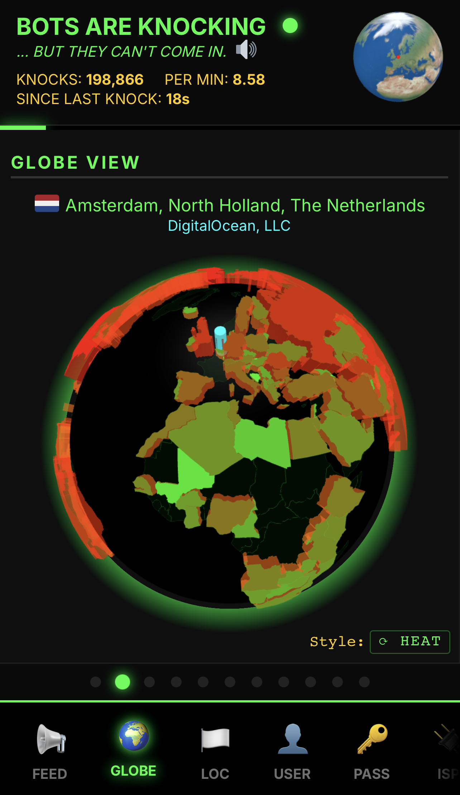
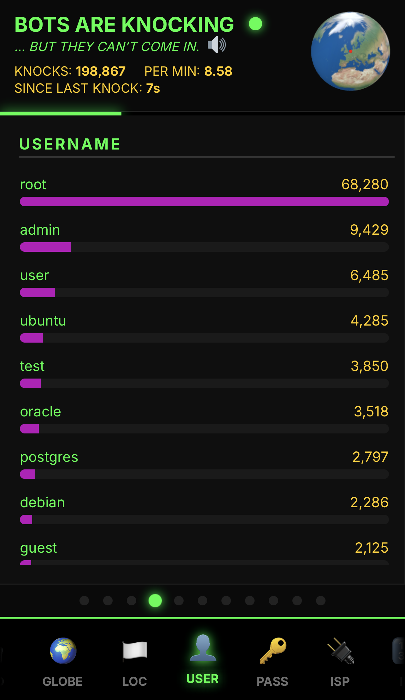
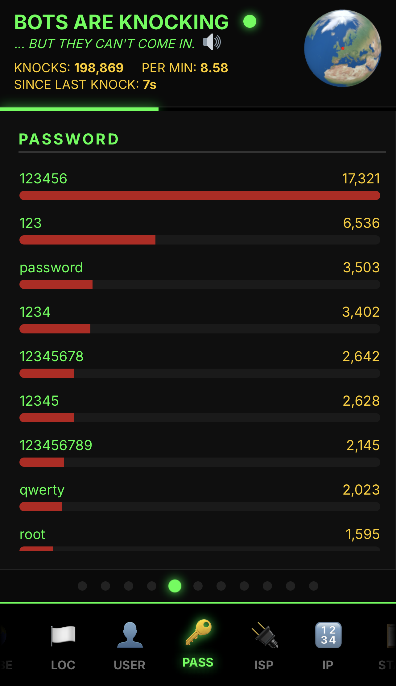
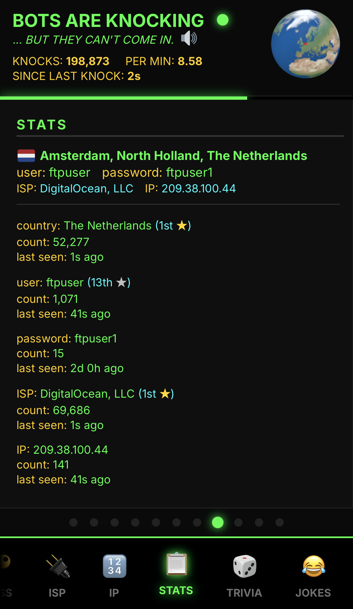
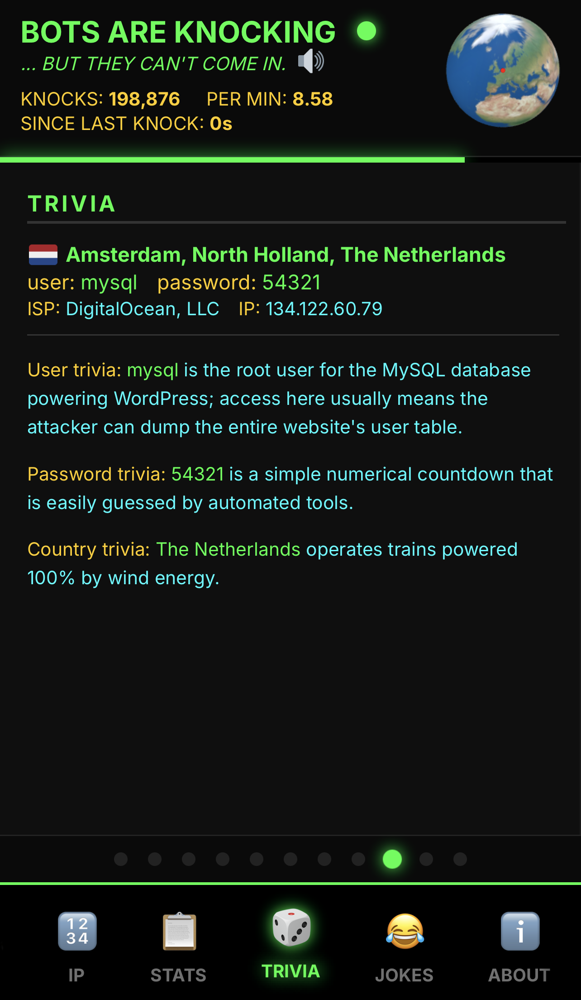

# Knock-Knock: Watch the Bots Trying to Break In

A real-time SSH honeypot with a live, globe-driven dashboard that makes internet noise feel like a weather map.
Live demo: `https://knock-knock.net`

## Screenshots

**Desktop**

<p align="center">
  
</p>

**Mobile (carousel panes)**

<p align="center">
  
  
  
</p>
<p align="center">
  
  
  
</p>
<p align="center">
  
</p>

## What It Does

Knock-Knock is a web-based app that lets you watch bots trying to break into an Internet-accessible server. It shows, in a fun and engaging way, information about the current break-in attempt, as well as historic statistics about the bot traffic. Individual panels show a live feed of the bots knocking on the server door, a globe showing the bot's origin, a list of the most common countries of origin, the most frequent user names and passwords attempted, the most common ISPs and IP addresses, and stats related to the current attempt, and trivia such as why a particular username might be chosen.

In technical speak, this program listens on the ssh port (22), and collects and displays new information every time a bot tries to log in. Here is the technical summary:

- Captures unauthorized SSH login attempts on port 22
- Enriches attacker IPs with GeoIP (city, country, ISP, ASN)
- Streams live events to the dashboard via WebSockets
- Maintains leaderboards and stats (top countries, users, passwords, ISPs)
- Works well on desktop and mobile with a swipeable carousel

## Architecture (In One Breath)

```
SSH Attacker → honeypot.py (port 22) → stdout (piped)
                                              ↓
                                       monitor.py (GeoIP lookup)
                                              ↓
                                    SQLite + Redis pub/sub
                                              ↓
                                       main.py (FastAPI)
                                              ↓
                                    WebSocket → Live Dashboard
```

## Quick Start (Docker)

```bash
# Prereqs: move real SSH off port 22, set up GeoIP DBs, create server.key
# Full steps in INSTALL.md

git clone https://github.com/djkurlander/knock-knock.git
cd knock-knock

docker compose up -d
```

## Installation

There are three supported install methods. Full instructions live in `INSTALL.md`.

- **Docker (simplest)**: `INSTALL.md#option-1-docker-simplest`
- **Ubuntu/Debian**: `INSTALL.md#option-2-ubuntudebian`
- **RHEL/CentOS/Fedora**: `INSTALL.md#option-3-rhelcentosfedora`

## Requirements

- Linux host with root access
- Redis
- MaxMind GeoLite2 databases (City and ASN)
- SSH moved off port 22 (the honeypot binds 22)
- SSL certs optional (for HTTPS)

## Live Demo

Visit `https://knock-knock.net` for a live dashboard.

## License

MIT
