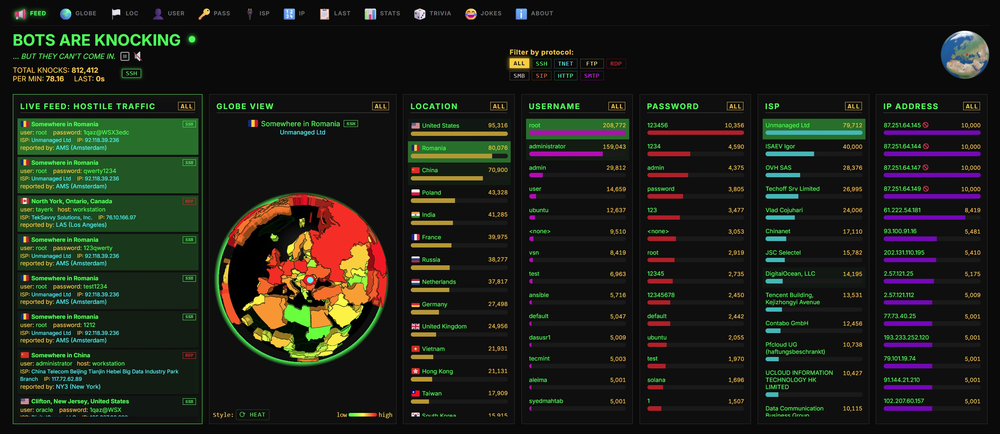
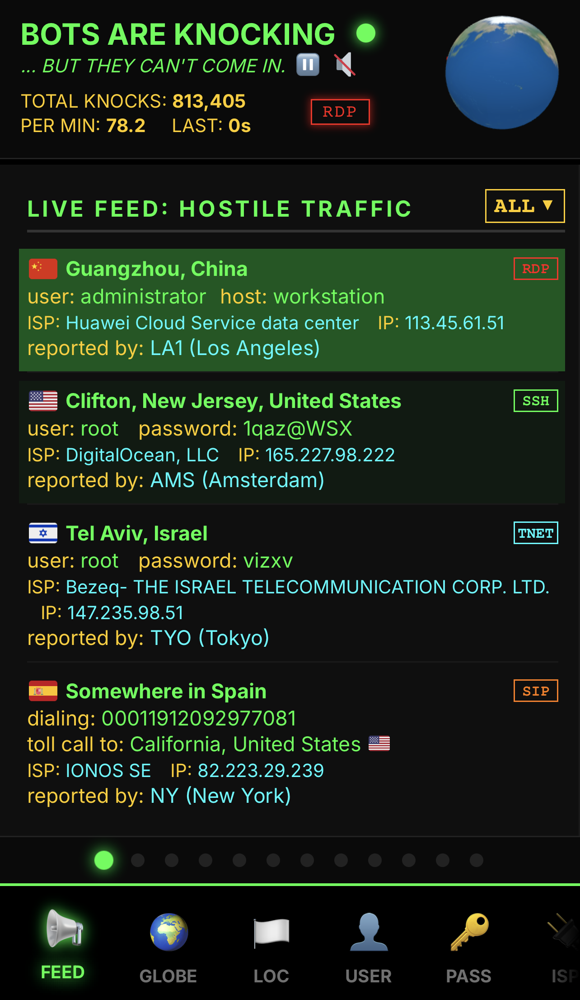
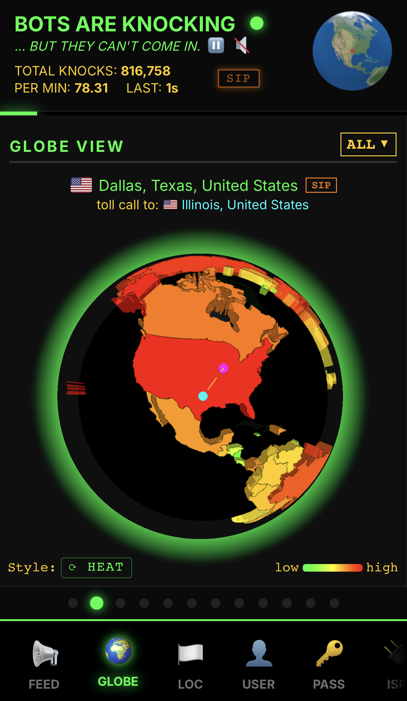
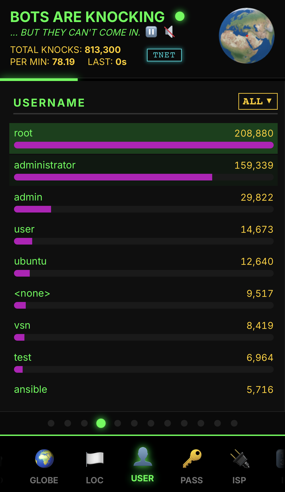
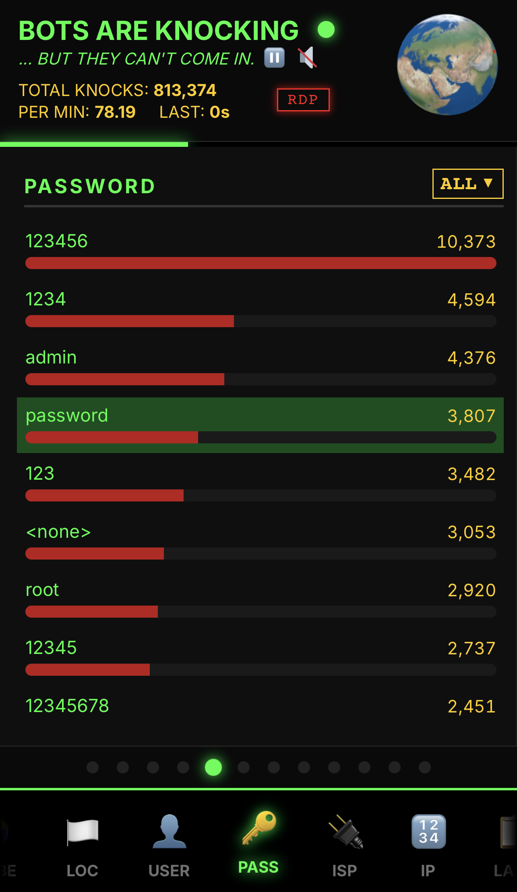
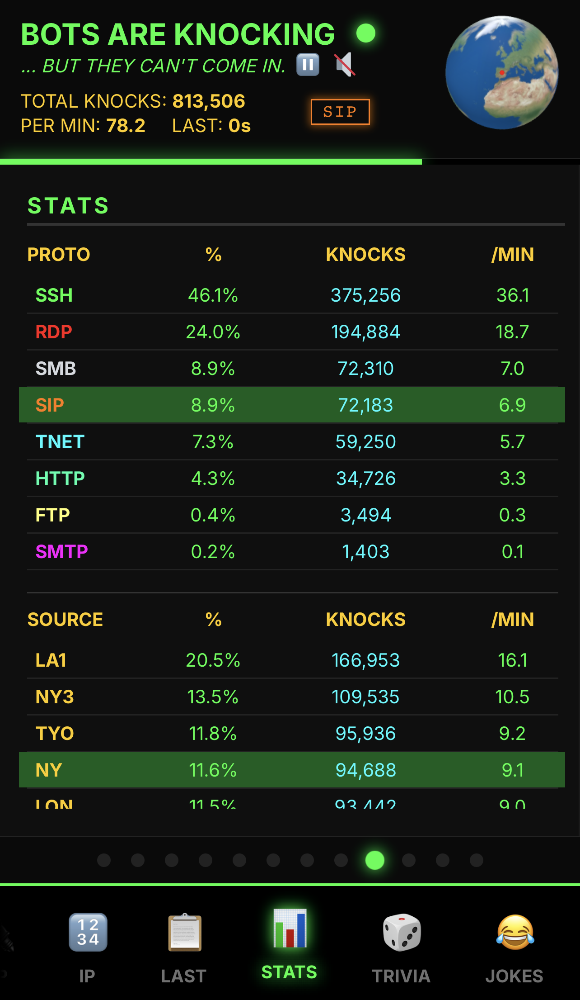
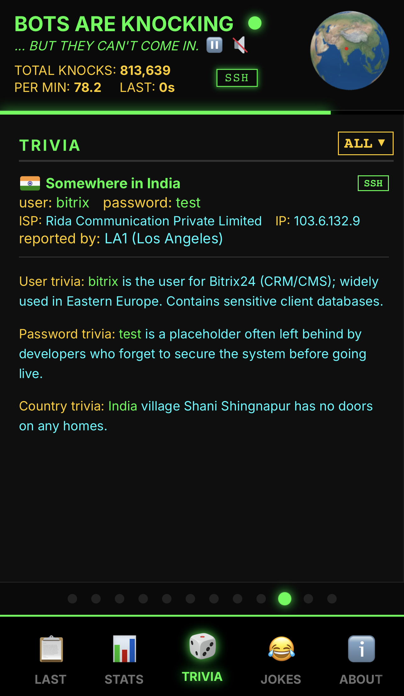

# Knock-Knock: Watch the Bots Try to Break In!

[](https://knock-knock.net)

**Live demo:** https://knock-knock.net

_**Watch** the bots trying to break into unprotected Internet servers, in this information-packed dashboard! **Discover** the most frequent countries of origin! **Be shocked** by the most common usernames and passwords! **Scoff at and ridicule** the worst offending ISPs and IPs! **Find out** why the bots are choosing these usernames and passwords!_

_**Marvel** at the spinning globe visualizations! Wait, is one of those globes a heat map too - how is that even possible? **Click** on the speaker icon to hear a virtual geiger counter measure what has been called **the background radiation of the Internet!**_

_**View** current break-in attempts and fascinating historic stats, in a series of dynamic, informative, and engaging panels! **Behold** bots attacking via SSH, Telnet, FTP, RDP, SMB, SIP, HTTP, and SMTP. **So, so, many protocols!** What? You want more servers too? **Stream** the attacks from multiple servers, and the data will come in so fast your head will spin, just like the globe!_


Check it out at https://knock-knock.net, or install it on your own server. Don't worry, these bots may be knocking, but they can't come in!

## Screenshots

**Desktop**

<p align="center">
  
</p>

**Mobile (carousel panes)**

<p align="center">
  
  
  
</p>
<p align="center">
  
  
  
</p>

## Features

- **Multi-Protocol:** View attacks across all the protocols (SSH, Telnet, FTP, RDP, SMB, SIP, HTTP, SMTP), or select a specific protocol to view.
- **Live Feed:** a realtime feed of bots trying to attack the server (knocks). Includes the location, username, password, ISP, IP, and protocol
- **Globe View:** a 3D globe showing the location of the last knock. Six different globe styles are available, including a cool extruded country heat map of worst offenders
- **Location:** the countries with the highest knock counts
- **Username:** the most popular usernames tried by the bots
- **Password:** the most common passwords attempted
- **ISP:** the ISP Wall of Shame
- **IP:** the worst offending IP addresses
- **Last:** knock counts and rankings for the country, user, password, ISP, and IP of the last knock
- **Stats:** the relative protocol frequencies, and (if aggregated) the frequency of knocks from the feeder servers
- **Trivia:** learn why a username or password may have been chosen
- **Jokes:** some very bad knock-knock jokes

## How It Works

- Listens on the protocol ports and captures all uninvited traffic
- Enriches attacker IPs with GeoIP (city, country, ISP, ASN)
- Streams live events to the dashboard via WebSockets
- Maintains leaderboards and stats (top countries, users, passwords, ISPs)
- Works well on desktop and mobile with a swipeable carousel

## Installation

Knock-Knock supports three different installation methods, with docker being the simplest. Full instructions live in [INSTALL.md](INSTALL.md).

- **Docker (simplest and universal)**
- **Ubuntu/Debian without Docker**
- **RHEL/CentOS/Fedora without Docker**

## Architecture (In One Breath)

```
Attacker
  ↓
protocol-specific honeypots (SSH, Telnet, FTP, RDP, SMB, SIP, HTTP, SMTP)
  ↓
monitor.py (GeoIP lookup)
  ↓
SQLite + Redis pub/sub
  ↓
main.py (FastAPI + WebSocket)
  ↓
Live Web Dashboard
```

## License

MIT
